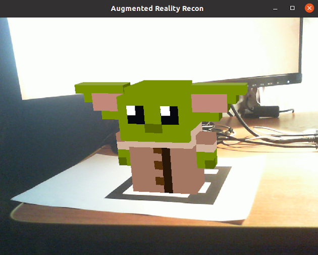

# Baby Grogu



3D Model of the Child renders on the marker.

This is studying project, that was made in the University.

### Running
The program has two required and one optional param: num of camera, path to calibration file, ["rasterization" word to use rasterization algorythm]
Examples of running:
```
0 /path/to/calibration.yaml
```

```
2 /path/to/calibration.yaml rasterization
```

If you don't use rasterization mode, polygons will render in determined previously order, it works faster.

Maybe you will need to specify -Dprism.forceGPU=true JVM param to run.

If you want to run this program, you should build or get OpenCV for java with Aruco.